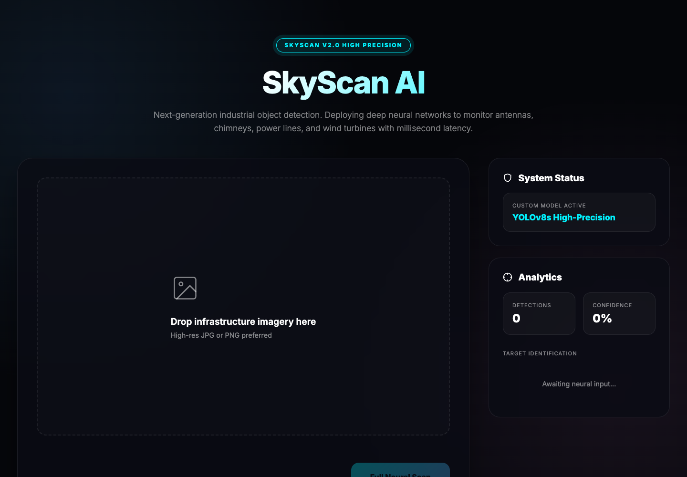
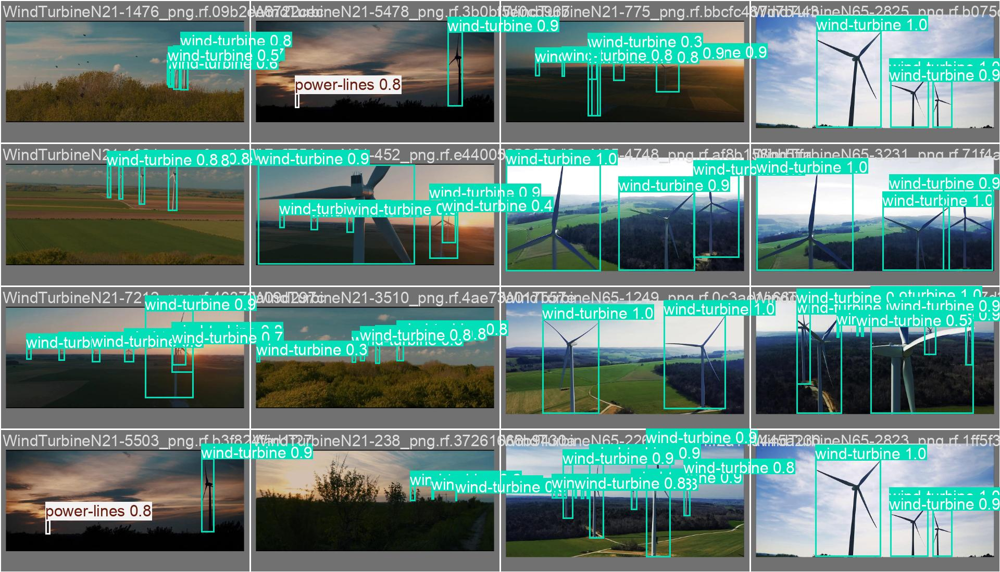
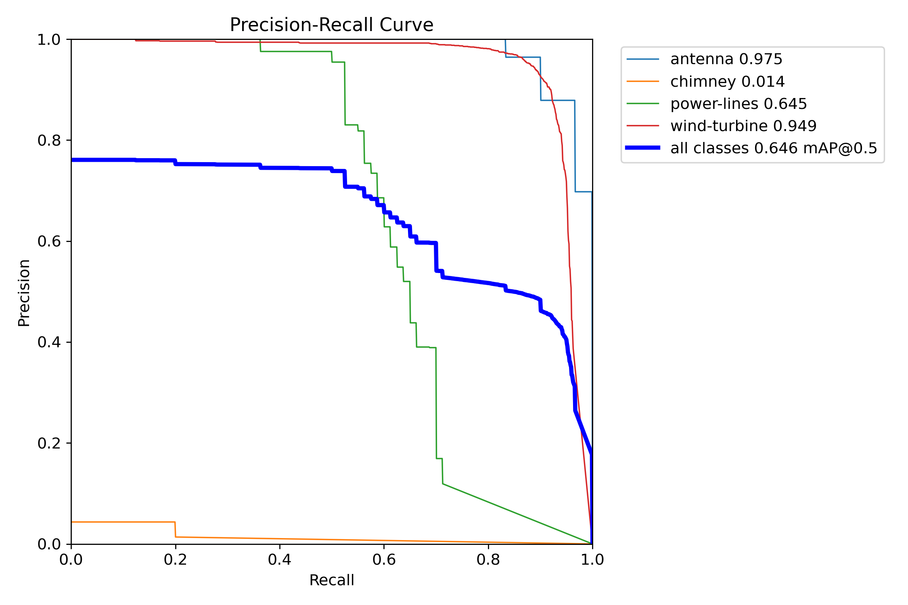
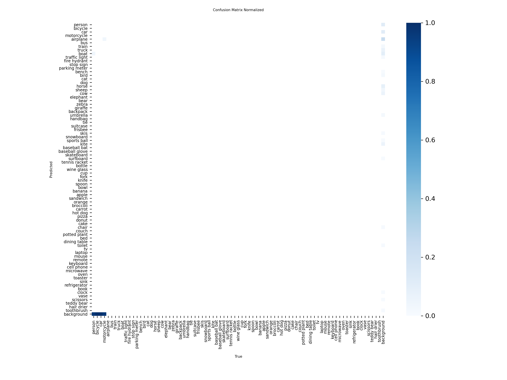

# 🔭 SkyScan AI

**Industrial infrastructure object detection — custom-trained YOLOv8s, deployed end-to-end.**

🚀 **Live demo:** https://skyscan-ods6.onrender.com
📡 **API docs (Swagger):** https://skyscan-ods6.onrender.com/docs

Upload an image and SkyScan detects **wind turbines, antennas, power lines, and chimneys** using a YOLOv8s model trained from scratch on a custom dataset — served through a FastAPI backend with a real-time browser frontend.

> ️ **Free-tier note:** the demo sleeps after ~15 min of inactivity; the first request may take 1–2 minutes while the service wakes and loads the model. Subsequent requests are fast.

| | |
|---|---|
|  |  |
| Glassmorphic upload UI with live model status | Real detections with confidence + latency |

---

## Highlights

- **Custom-trained model** — fine-tuned YOLOv8s on ~1,190 labelled infrastructure images (4 classes), 200 epochs, GPU training in Google Colab
- **Measured performance** — final validation: **Precision 0.89 · Recall 0.60 · mAP@50 0.65 · mAP@50-95 0.46**
- **Full-stack deployment** — FastAPI inference server + drag-and-drop frontend, deployed to Render with the checkpoint shipped in the repo
- **Production thinking** — automatic best-checkpoint discovery, `/status` health endpoint, latency instrumentation, graceful model fallback
- **Reproducible training** — complete notebook (`windmill_training_v2.ipynb`), dataset config, and all training/validation artifacts committed as evidence

---

## Results

Final epoch (200) on the validation split:

| Metric | Value |
|---|---|
| Precision | 0.890 |
| Recall | 0.603 |
| mAP@0.5 | 0.649 |
| mAP@0.5:0.95 | 0.462 |




Per-class breakdown, curves, and prediction samples live in `runs/` — every number quoted above is verifiable from the committed `results.csv`.

---

## Architecture

```text
Browser (index.html — drag & drop, animated overlays)
        │  POST /predict (multipart image)
        ▼
FastAPI (app.py)
  ├── startup: find_latest_best_pt() → YOLO(best.pt) cached once
  ├── inference: OpenCV decode → YOLOv8s → JSON {bbox, confidence, class, latency_ms}
  └── GET /status → model path + checkpoint health
        │
        ▼
Render (free CPU tier) — repo ships the trained checkpoint
```

Key engineering decisions:

- **Model cached at startup** — reloading the 21 MB checkpoint per request was the single biggest latency source; one load makes warm inference seconds-fast
- **Auto-discovery of the newest `best.pt`** under `runs/detect/*/weights/`, with fallback to base YOLOv8n so the API never hard-fails
- **Palm-relative dataset design** — 4 infrastructure classes chosen to cover renewable-energy and telecom inspection use cases
- **Latency returned with every response** so the frontend can show honest performance numbers

## Tech Stack

| Layer | Technology |
|---|---|
| Model | YOLOv8s (Ultralytics) |
| Training | Google Colab GPU, 200 epochs, 640px, batch 16 |
| Backend | FastAPI + Uvicorn |
| Frontend | Vanilla HTML/CSS/JS (drag & drop, live overlays) |
| Vision | OpenCV, NumPy |
| Deployment | Render (free tier) |

---

## API

```text
GET  /status    → {"status": "ready", "model_path": "...", "checkpoint_exists": true}
POST /predict   → multipart "file"; returns detections + latency_ms
```

Try it:

```bash
curl -X POST https://skyscan-ods6.onrender.com/predict \
  -F "file=@your_image.jpg"
```

Interactive Swagger UI: https://skyscan-ods6.onrender.com/docs

---

## Local Setup

```bash
git clone https://github.com/radhika-verma06/SkyScan.git
cd SkyScan
pip install -r requirements.txt
python3 app.py        # → http://localhost:8000
```

Retraining (optional): open `windmill_training_v2.ipynb`, point `data.yaml` at your dataset copy, and run the notebook. The app auto-loads the newest checkpoint from `runs/detect/*/weights/best.pt`.

---

## Project Structure

```text
SkyScan/
├── app.py                        # FastAPI inference server
├── index.html                    # Browser UI (single-file frontend)
├── data.yaml                     # YOLO dataset config
├── train.py                      # Standalone training script
├── windmill_training_v2.ipynb    # Full training notebook (Colab)
├── runs/
│   ├── detect/high_precision_windmill-4/weights/best.pt   # deployed checkpoint
│   ├── detect/train2/            # training logs, curves, results.csv
│   └── detect/val3/              # validation evidence (PR, F1, confusion matrix)
├── assets/                       # README screenshots and result charts
└── requirements.txt
```

---

## Use Cases

- Renewable-energy asset monitoring (wind farm inspection)
- Telecom infrastructure inventory (antennas/towers)
- Power-grid line mapping
- Aerial/drone image triage
- Industrial site compliance review

---

## Honest Limitations

- Dataset is ~1,190 images — solid for a prototype, not production-grade
- Recall (0.60) lags precision (0.89): the model is conservative and misses small/occluded objects
- Free-tier Render cold starts take 1–2 minutes; production would need a paid instance or autoscaling warm pool
- Single-image inference only; batch/video modes are planned

## Roadmap

- [ ] Expand dataset (target: 5k+ images, harder negatives) to push mAP@50 past 0.75
- [ ] Batch upload + video inference
- [ ] Dockerized deploy with health-checked warm keep-alive
- [ ] Per-class thresholds and NMS tuning sweep
- [ ] Model registry / version tracking for checkpoints

---

## License

MIT — see [LICENSE](LICENSE).

### Built by Radhika Verma
AI student · Computer Vision · Applied AI Systems
